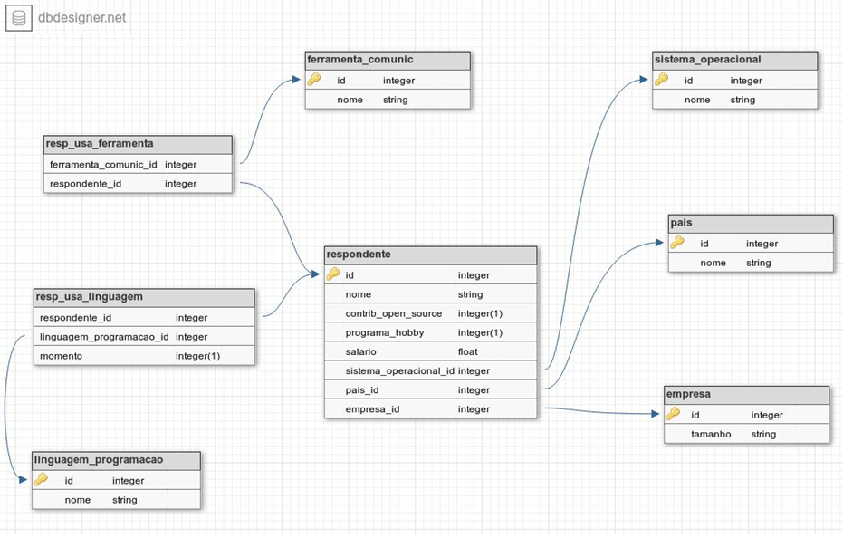

# Ironhack Final Project: Case AME-Digital

Project status: Completed

# Project objective

This data viz project comes from the fintech AME-Digital's case for Data Engineers.
The case itself is based on the Stack Overflow 2018 Developer Survey (available on Kaggle: https://www.kaggle.com/datasets/stackoverflow/stack-overflow-2018-developer-survey).
Nearly 100,000 developers took the 30-minute survey in January 2018, answering a total of 129 questions ranging from basic info (gender, age, job title, annual salary estimate) to subjective opinions regarding ethics in coding and responsability towards AI creations.

The case sets specific goals: answering questions regarding average salary of respondents, where they are from, what technologies and communication tools they use etc.

This final project, however, aimed to go beyond the case itself. Since the focus is on salary data, I've implemented a predictive model that gives a salary estimate based on a number of factors: how long one has worked with programming, what is the size of the company one's currently working in, what country one's working in etc.

This predictive model lead to interesting conclusions about the case itself, which I will detail further below.

# Technologies

Python

MySQL

SQLAlchemy

Pandas

Sklearn

Tableau

# Project Description

The case itself is heavily focused on SQL queries. It is divided into 2 portions:

1) Populating a data bank from the raw survey data.

2) Performing SQL queries to answer the given questions.

My final project aimed to focus on data viz, thus after answering the case's questions my goal was to generate insights from respondents' salary data.

# Steps

## Data Inspection and cleaning

Of a total of 98,855 respondents, 67,441 (68.2%) fully completed the survey. Their answers are available in the csv file "survey_results_public.csv" and were transported into a
Pandas DataFrame for inspection. As the snapshot below shows, most of the data was previously curated.

Cleaning was therefore limited to reindexing, converting NaNs to 0.0 for salaries and converting Yes/No questions to 1's and 0's, as requested on the case description.
This proved useful later when building the predictive model due to a faster processing of numerical rather than categorical variables.
Some questions e.g. "LanguageWorkedWith" which involved multiple inputs required processing for isolating multiple answers with split and explode methods.

Some of the most precious variables from this dataset are undoubtedly the ones concerning salaries. The Stack Overflow survey included an extra variable "Converted Salary" which
normalizes all the inputs to a single format: yearly salary in US$. This is exceptional considering that input by respondents came in myriad formats regarding currencies
and salary types (e.g. yearly, monthly or weekly). These were all done for the current exchange rates from January 2018.

## Insights from salary data:

    

A simple scatter plot of normalized salary entries yields a gamma distribution with some expected results:
Out of 47,702 entries, about 80% of entries are up to 100k US$/year. This rises to  over 93% when up to 200k US$/year i.e. only a minority of respondents have "astronomical" salaries.
Highlighted in the plot are two conspicuous features: outliers for salaries exactly at 1 million and 2 million US$/year. These suggest that some respondents rounded their revenue for convenience.

If we filter a range of people earning at least a minimum wage (for Brazilian standards in 2018, roughly 3,000 US$/year) up to 500,000 US$/year (rich, but not astronomically so),
the distribution becomes roughly logarithmic.

Hidden beneath this plot, however, are discrepancies that arise from the respondent profile: their gender, for example, betray a salary gap *dependent* on their nationality, as we will see below in detail.

A number of other factors play a role here, ranging from the years of experience that an employee has with coding to the size of the company in which they are employed.\

## Populating the data bank.

The data bank structure is provided by the case itself and can be seen in the figure below:

